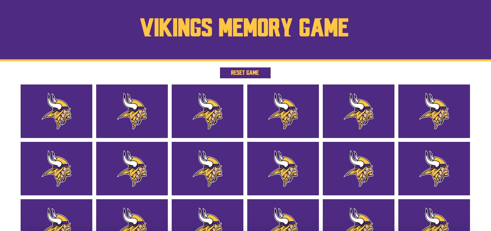
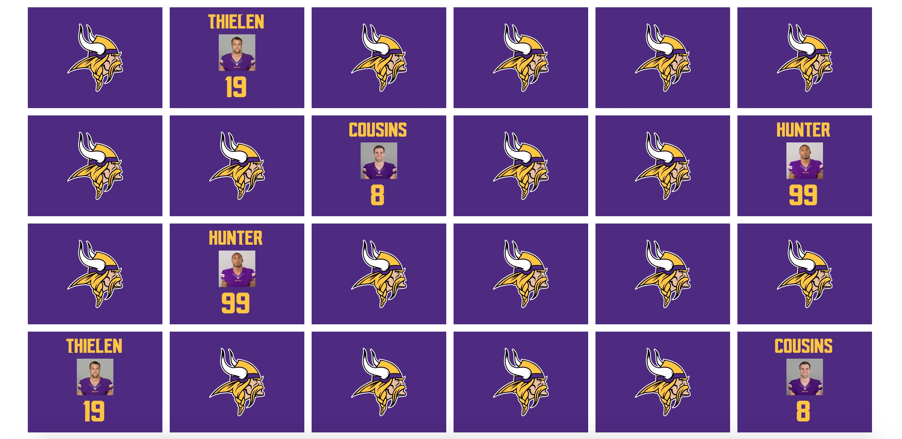
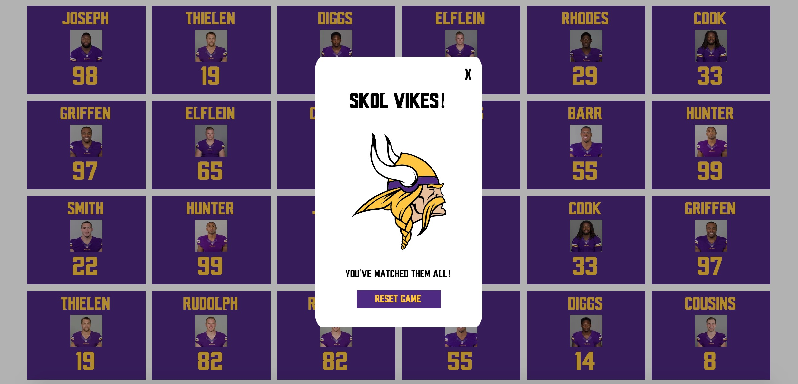

# Vikings Memory Game

## Description
A fun memory matching card game in anticipation of the Vikings 2018-19 season. The game is built using React and styled with CSS. The game allows users to match 12 pairs of shuffled cards and includes animations indicating a successful and unsuccessful match. The user is prompted with a modal upon successfully completing the game as well as a reset button to re-shuffle the deck and play again.

## Getting Started
1. Open a terminal and clone the repository to your local machine: <tt>git clone https://github.com/KlimekM/vikings-memory-game.git</tt>
2. Within the project directory in your terminal, install the dependencies by running <tt>npm install</tt> *if you do not have npm installed you can get started here: https://www.npmjs.com/get-npm
3. Run the server by running the following command in your terminal <tt>npm start</tt>
4. Running the server should open up a window with the app. Otherwise, navigate to: <tt>http://localhost:3000/</tt>
5. Test your memory by matching the cards!

## Screenshots

#### Header and Initial Game Board:

#### Game Board with a few matched cards:

#### Modal (shown upon successfully matching all of the cards):

